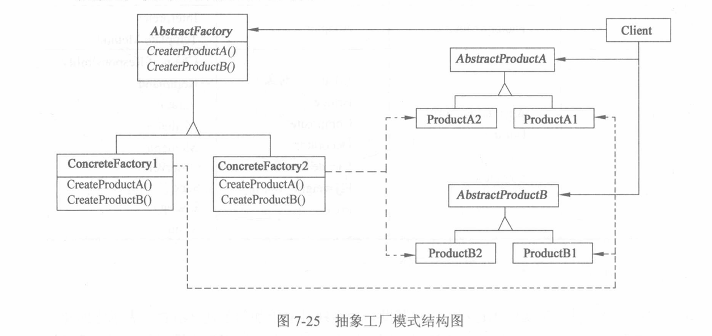
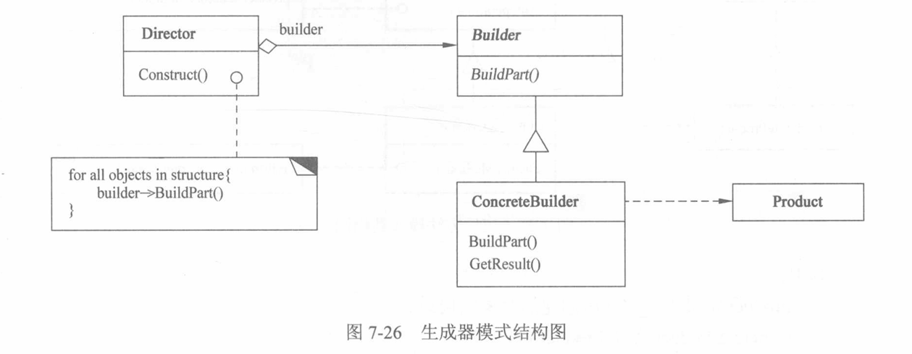
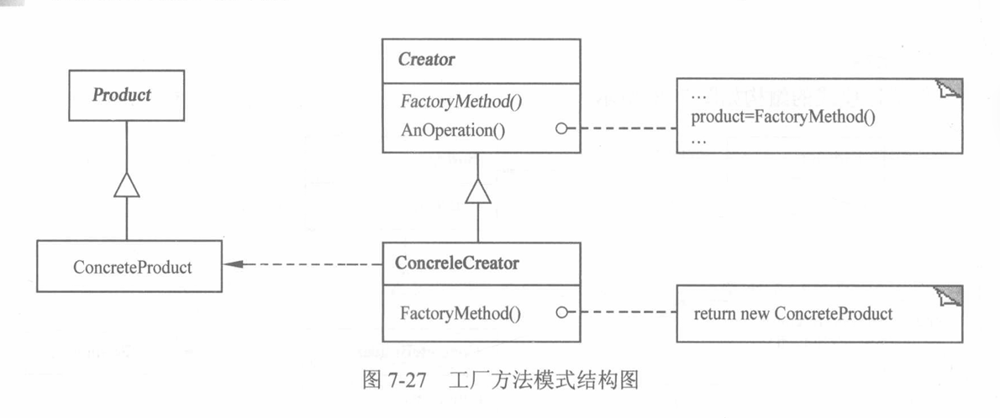
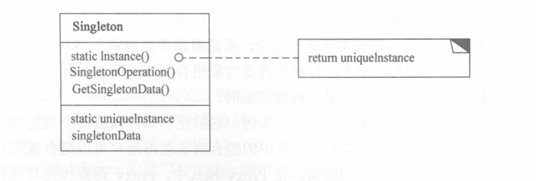
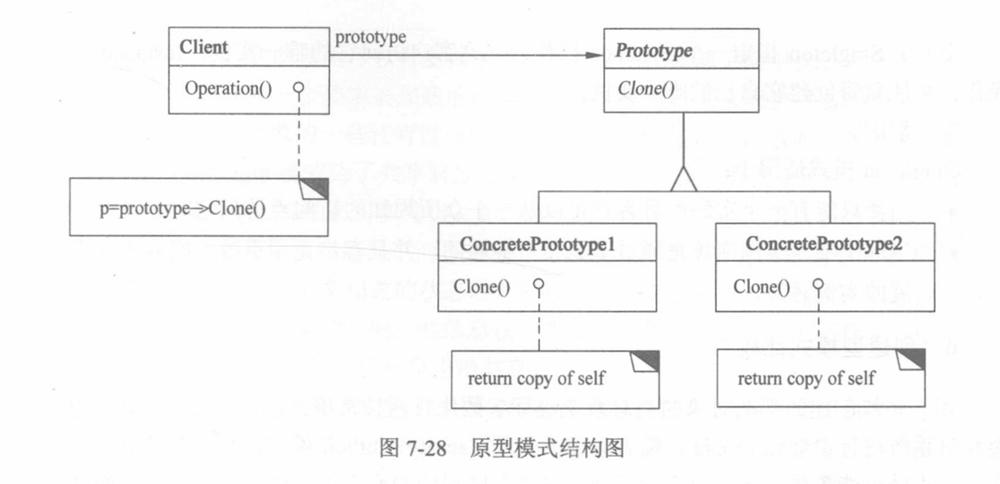
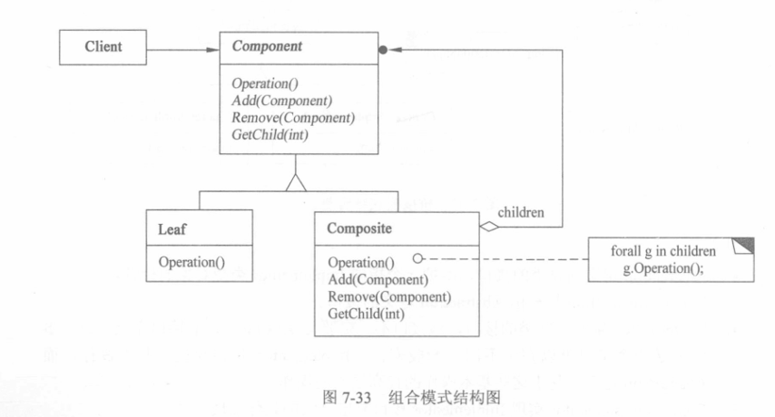
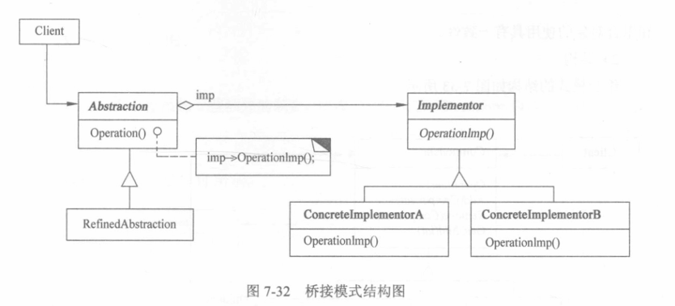
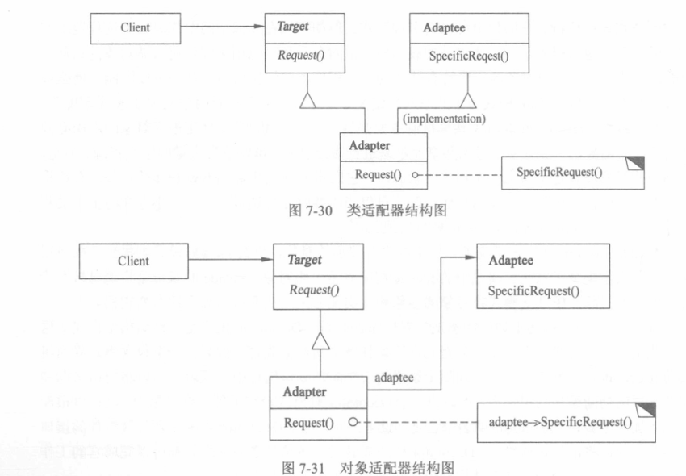

# DesignPattern

Java设计模式学习笔记

---

## 目录结构

```
src/
├── creational/              # 创建型模式（5种）
│   ├── abstractfactory/     # 抽象工厂模式
│   ├── builder/             # 生成器模式
│   ├── factorymethod/       # 工厂方法模式
│   ├── prototype/           # 原型模式
│   └── singleton/           # 单例模式
├── structural/              # 结构型模式（7种，待编码实现）
│   ├── composite/           # 组合模式
│   ├── proxy/               # 代理模式
│   ├── flyweight/           # 享元模式
│   ├── facade/              # 外观模式
│   ├── bridge/              # 桥接模式
│   ├── decorator/           # 装饰模式
│   └── adapter/             # 适配器模式
└── behavioral/              # 行为型模式（待学习）
```

---

## 一、创建型模式

### 1. 抽象工厂模式（Abstract Factory）

#### 什么是抽象工厂模式？

**一句话**：提供一个接口，用于创建一系列相关的产品，而不需要指定具体类。

#### 生活中的例子：家具工厂

| 角色 | 对应类 |
|------|--------|
| 抽象工厂 | `AbstractFactory` - 定义能生产什么 |
| 现代工厂 | `ConcreteFactory1` - 生产现代家具 |
| 古典工厂 | `ConcreteFactory2` - 生产古典家具 |
| 抽象椅子 | `AbstractProductA` - 椅子接口 |
| 现代椅子 | `ProductA1` |
| 古典椅子 | `ProductA2` |
| 抽象桌子 | `AbstractProductB` - 桌子接口 |
| 现代桌子 | `ProductB1` |
| 古典桌子 | `ProductB2` |

#### UML类图



#### 图解说明

**1. 左侧 - 工厂部分**

```
┌─────────────────┐
│  AbstractFactory│  ← 抽象工厂接口
│  CreateProductA()│    定义"能生产什么"
│  CreateProductB()│
└────────┬────────┘
         │ 继承
    ┌────┴────┐
    ▼         ▼
┌──────────┐ ┌──────────┐
│Concrete   │ │Concrete   │  ← 具体工厂
│Factory1  │ │Factory2  │    实现具体生产逻辑
└──────────┘ └──────────┘
```

**2. 右侧 - 产品部分**

```
AbstractProductA（抽象产品A接口）
       ├── ProductA1（具体产品A1）
       └── ProductA2（具体产品A2）

AbstractProductB（抽象产品B接口）
       ├── ProductB1（具体产品B1）
       └── ProductB2（具体产品B2）
```

**3. 虚线箭头 - 依赖关系**

```
ConcreteFactory1 ┄┄┄→ ProductA1  （工厂1生产产品A1）
ConcreteFactory1 ┄┄┄→ ProductB1  （工厂1生产产品B1）
ConcreteFactory2 ┄┄┄→ ProductA2  （工厂2生产产品A2）
ConcreteFactory2 ┄┄┄→ ProductB2  （工厂2生产产品B2）
```

**4. Client（客户端）**

```
Client ────→ AbstractFactory      （使用工厂）
Client ────→ AbstractProductA     （使用产品A）
Client ────→ AbstractProductB     （使用产品B）
```

Client 只依赖抽象接口，不知道具体是哪个工厂或产品。

---

#### 图与代码的对应关系

| 图中元素 | 代码文件 | 说明 |
|---------|---------|------|
| AbstractFactory | `AbstractFactory.java` | 抽象工厂接口 |
| CreateProductA() | `createChair()` | 生产产品A的方法 |
| CreateProductB() | `createTable()` | 生产产品B的方法 |
| ConcreteFactory1 | `ConcreteFactory1.java` | 现代家具工厂 |
| ConcreteFactory2 | `ConcreteFactory2.java` | 古典家具工厂 |
| AbstractProductA | `AbstractProductA.java` | 椅子接口 |
| AbstractProductB | `AbstractProductB.java` | 桌子接口 |
| ProductA1 | `ProductA1.java` | 现代椅子 |
| ProductA2 | `ProductA2.java` | 古典椅子 |
| ProductB1 | `ProductB1.java` | 现代桌子 |
| ProductB2 | `ProductB2.java` | 古典桌子 |

#### 核心思想

1. **产品配套**：一个工厂只生产一种风格，不会混搭
2. **易于切换**：换风格 = 换工厂
3. **易于扩展**：新增风格 = 新增工厂类

#### 运行结果

```
=== 现代风格家具 ===
坐在现代简约椅子上，舒适简洁
在现代简约桌子上放东西，干净利落

=== 古典风格家具 ===
坐在古典雕花椅子上，优雅复古
在古典实木桌子上放东西，古色古香
```

#### 适用场景

- 系统需要多套产品系列（如：不同主题的UI组件）
- 需要确保产品配套使用
- 想要隔离具体类的依赖

#### 优劣势

| 优势 | 劣势 |
|------|------|
| ✅ 产品配套，不会混搭（华为手机配华为平板） | ❌ 新增产品类型困难（要改抽象工厂接口） |
| ✅ 易于切换风格（换个工厂就行） | ❌ 类数量增多（每个产品都要一个类） |
| ✅ 符合开闭原则（新增风格只加类） | ❌ 代码复杂度增加 |

---

### 2. 生成器模式（Builder Pattern）

#### 什么是生成器模式？

**一句话**：将复杂对象的构建过程与表示分离，同样的构建过程可以创建不同的表示。

#### 生活中的例子：造房子

| 角色 | 对应类 | 说明 |
|------|--------|------|
| 工头 | `Director` | 指挥建造流程，告诉工人先干什么再干什么 |
| 工人接口 | `Builder` | 定义建造步骤，但不知道具体怎么造 |
| 别墅施工队 | `VillaBuilder` | 实现别墅的建造 |
| 平房施工队 | `BungalowBuilder` | 实现平房的建造 |
| 房子 | `House` | 最终产品 |

#### UML类图



#### 图解说明

**1. Director（指挥者/工头）**

```
Director
├── construct()    // 指挥建造流程
└── builder        // 持有建造者引用
```

**2. Builder（抽象建造者）**

```
Builder
├── buildFoundation()   // 打地基
├── buildWall()         // 砌墙
├── buildRoof()         // 盖屋顶
└── getResult()         // 获取结果
```

**3. ConcreteBuilder（具体建造者）**

```
VillaBuilder        BungalowBuilder
├── 别墅地基         ├── 平房地基
├── 别墅墙壁         ├── 平房墙壁
├── 别墅屋顶         ├── 平房屋顶
└── 返回别墅         └── 返回平房
```

#### 核心思想

```
Director（工头）只关心流程：
    buildFoundation() → buildWall() → buildRoof()

Builder（工人）关心实现：
    具体怎么打地基、怎么砌墙、怎么盖屋顶
```

#### 代码结构

```
Builder.java            // 抽象建造者接口
├── buildFoundation()   // 步骤1：打地基
├── buildWall()         // 步骤2：砌墙
├── buildRoof()         // 步骤3：盖屋顶
└── getResult()         // 获取产品

VillaBuilder.java       // 别墅施工队（具体建造者）
BungalowBuilder.java    // 平房施工队（具体建造者）

Director.java           // 工头（指挥者）
└── construct()         // 按顺序调用建造步骤

House.java              // 产品（房子）
```

#### 运行结果

```
=== 建造别墅 ===
工头：开始指挥建造...
别墅施工队：打别墅地基（深度5米，钢筋混凝土）
别墅施工队：砌别墅墙壁（三层，落地窗）
别墅施工队：盖别墅屋顶（坡屋顶，琉璃瓦）
工头：建造完成！
结果：房子 {地基='别墅地基（深度5米，钢筋混凝土）', 墙壁='别墅墙壁（三层，落地窗）', 屋顶='别墅屋顶（坡屋顶，琉璃瓦）'}

=== 建造平房 ===
工头：开始指挥建造...
平房施工队：打平房地基（深度2米，普通混凝土）
平房施工队：砌平房墙壁（一层，普通窗户）
平房施工队：盖平房屋顶（平顶，防水层）
工头：建造完成！
结果：房子 {地基='平房地基（深度2米，普通混凝土）', 墙壁='平房墙壁（一层，普通窗户）', 屋顶='平房屋顶（平顶，防水层）'}
```

#### 适用场景

- 对象有很多属性，有些可选
- 需要按步骤创建复杂对象
- 想要同样的流程创建不同类型的对象

#### 优劣势

| 优势 | 劣势 |
|------|------|
| ✅ 分离构建过程，同样的流程造不同产品 | ❌ 每个产品都要写一个Builder类 |
| ✅ 可以精细控制构建步骤 | ❌ 产品之间差异太大时不适用 |
| ✅ 链式调用更优雅（可选） | ❌ 增加了Director、Builder等类 |
| ✅ 不可变对象更容易实现 | ❌ 对于简单对象，反而增加复杂度 |

---

### 3. 工厂方法模式（Factory Method）

#### 什么是工厂方法模式？

**一句话**：让子类决定创建什么对象，父类只定义使用对象的流程。

#### 生活中的例子：数据库连接

| 角色 | 对应类 | 说明 |
|------|--------|------|
| 数据库工厂 | `DatabaseFactory` | 抽象工厂，定义连接流程 |
| MySQL工厂 | `MySQLFactory` | 创建MySQL连接 |
| Oracle工厂 | `OracleFactory` | 创建Oracle连接 |
| 数据库连接 | `DatabaseConnection` | 抽象产品，定义连接功能 |
| MySQL连接 | `MySQLConnection` | 具体产品1 |
| Oracle连接 | `OracleConnection` | 具体产品2 |

#### UML类图


#### 图解说明

**1. Creator（抽象工厂）**

```
DatabaseFactory（抽象工厂）
├── createConnection()    // 工厂方法：让子类实现
└── executeQuery()        // 业务方法：使用连接
```

**2. ConcreteCreator（具体工厂）**

```
MySQLFactory              OracleFactory
├── createConnection()    ├── createConnection()
└── return MySQL          └── return Oracle
```

**3. Product（抽象产品）**

```
DatabaseConnection（数据库连接接口）
├── connect()    // 连接
├── query()      // 查询
└── close()      // 关闭
```

**4. ConcreteProduct（具体产品）**

```
MySQLConnection           OracleConnection
├── 连接MySQL             ├── 连接Oracle
├── 执行MySQL查询         ├── 执行Oracle查询
└── 关闭MySQL连接         └── 关闭Oracle连接
```

#### 核心思想

```
父类（DatabaseFactory）：
    我要用连接，但不知道用哪个
    子类告诉我（createConnection）

子类（MySQLFactory/OracleFactory）：
    我知道创建哪个连接
    return new MySQLConnection()
```

#### 代码结构

```
DatabaseConnection.java       // 抽象产品：数据库连接接口
├── connect()
├── query()
└── close()

MySQLConnection.java          // 具体产品1：MySQL连接
OracleConnection.java         // 具体产品2：Oracle连接

DatabaseFactory.java          // 抽象工厂：定义流程
├── createConnection()        // 工厂方法（抽象）
└── executeQuery()            // 业务方法

MySQLFactory.java             // 具体工厂1：创建MySQL连接
OracleFactory.java            // 具体工厂2：创建Oracle连接
```

#### 运行结果

```
=== 使用 MySQL ===
MySQL工厂：创建MySQL连接
=== 开始执行查询 ===
连接 MySQL 数据库：jdbc:mysql://localhost:3306/mydb
MySQL 执行查询：SELECT * FROM users
关闭 MySQL 连接
=== 查询结束 ===

=== 使用 Oracle ===
Oracle工厂：创建Oracle连接
=== 开始执行查询 ===
连接 Oracle 数据库：jdbc:oracle:thin:@localhost:1521:orcl
Oracle 执行查询：SELECT * FROM orders
关闭 Oracle 连接
=== 查询结束 ===
```

#### 适用场景

- 不知道具体用哪个类（根据配置决定）
- 未来会加新品类（加新类不动旧代码）
- 想让子类决定创建什么对象

#### 优劣势

| 优势 | 劣势 |
|------|------|
| ✅ 符合开闭原则（加新品只加类） | ❌ 每个产品都要一个工厂类 |
| ✅ 解耦（父类不依赖具体类） | ❌ 类数量增多 |
| ✅ 易于扩展（加新工厂就行） | ❌ 对于简单场景有点过度设计 |

#### 与抽象工厂的区别

| 工厂方法 | 抽象工厂 |
|---------|---------|
| 一个工厂只生产**一种**产品 | 一个工厂生产**一系列**产品 |
| `createConnection()` | `createChair()` + `createTable()` |
| 简单，但产品多了工厂也多 | 产品配套，但结构复杂 |

---

### 4. 原型模式（Prototype Pattern）

#### 什么是原型模式？

**一句话**：用克隆代替new，复制已有对象来创建新对象。

#### 生活中的例子：简历投递

| 角色 | 对应 | 说明 |
|------|------|------|
| 简历模板 | `Resume` | 包含基本信息的模板 |
| 克隆方法 | `clone()` | 复制简历 |
| 投递简历 | 克隆后修改目标公司 | 不用重新写 |

#### UML类图



#### 图解说明

**1. Prototype（原型接口）**

```
Prototype
└── Clone()  // 克隆方法，返回自己的副本
```

**2. ConcretePrototype（具体原型）**

```
Resume（简历）
├── name        // 姓名
├── education   // 学历
├── skills      // 技能
├── targetCompany  // 目标公司
└── Clone()     // 克隆自己，返回新简历
```

**3. Client（客户端）**

```
Client
├── 创建模板简历
├── 克隆简历1 → 修改目标公司
├── 克隆简历2 → 修改目标公司
└── 克隆简历3 → 修改目标公司
```

#### 核心思想

```
传统方式：new一个新对象，手动设置属性
    User user = new User();
    user.setName("张三");
    user.setAge(25);

原型模式：克隆已有对象
    User user = template.clone();
    user.setTargetCompany("阿里巴巴");
```

#### 代码结构

```
Resume.java     // 具体原型：简历
├── name, education, skills  // 基本信息（不变）
├── targetCompany            // 目标公司（可变）
└── clone()                  // 克隆方法

Client.java     // 测试类
├── 创建模板
├── 克隆多份简历
└── 修改目标公司
```

#### 运行结果

```
=== 创建简历模板 ===
模板内容：
姓名：张三
学历：本科
技能：Java, Python, 设计模式
目标公司：（待定）

=== 克隆简历投递不同公司 ===
--- 简历1 ---
姓名：张三
学历：本科
技能：Java, Python, 设计模式
目标公司：阿里巴巴

--- 简历2 ---
姓名：张三
学历：本科
技能：Java, Python, 设计模式
目标公司：腾讯

--- 简历3 ---
姓名：张三
学历：本科
技能：Java, Python, 设计模式
目标公司：字节跳动
```

#### 适用场景

- 对象创建成本高（比如要查数据库）
- 需要大量相似对象
- 想要保持对象状态不变

#### 优劣势

| 优势 | 劣势 |
|------|------|
| ✅ 简化对象创建（不用new + 设置属性） | ❌ 需要实现Cloneable接口 |
| ✅ 性能更好（克隆比new快） | ❌ 浅拷贝可能有问题（引用类型） |
| ✅ 保持对象状态 | ❌ 代码略复杂 |

#### 深拷贝 vs 浅拷贝

| 类型 | 说明 | 风险 |
|------|------|------|
| 浅拷贝 | 只复制基本类型，引用类型复制地址 | 修改一个会影响另一个 |
| 深拷贝 | 完全独立的副本 | 安全，但更耗性能 |

---

### 5. 单例模式（Singleton Pattern）

#### 什么是单例模式？

**一句话**：保证一个类只有一个实例，并提供全局访问点。

#### 生活中的例子：校长

一个学校只有一个校长，不管谁去找校长，找到的都是同一个人。

| 角色 | 对应 | 说明 |
|------|------|------|
| 学校 | Singleton类 | 整个系统只有一个 |
| 校长 | uniqueInstance | 唯一的实例 |
| 找校长 | getInstance() | 获取唯一实例的方法 |

#### UML类图



#### 图解说明

**1. Singleton（单例类）**

```
Singleton
├── static Instance()       // 静态方法：获取唯一实例
├── SingletonOperation()    // 业务方法
├── GetSingletonData()      // 获取数据
├── static uniqueInstance   // 静态变量：保存唯一实例
└── singletonData           // 单例的数据
```

**2. 关键点**

```
构造函数私有化 → 不能从外部 new
静态变量 → 保存唯一的实例
静态方法 → 提供获取实例的入口
```

#### 核心思想

```
不管调用多少次 getInstance()，返回的都是同一个对象

Singleton s1 = Singleton.getInstance();
Singleton s2 = Singleton.getInstance();
s1 == s2  // true，同一个实例
```

#### 两种实现方式

| 方式 | 特点 | 适用场景 |
|------|------|---------|
| 懒汉式 | 用到时才创建（懒加载） | 实例创建开销大 |
| 饿汉式 | 类加载时就创建 | 实例创建开销小，需要快速访问 |

#### 代码结构

**懒汉式（SingletonLazy.java）**

```
private static SingletonLazy instance;  // 初始为null

public static SingletonLazy getInstance() {
    if (instance == null) {  // 第一次调用时才创建
        instance = new SingletonLazy();
    }
    return instance;
}
```

**饿汉式（SingletonHungry.java）**

```
private static SingletonHungry instance = new SingletonHungry();  // 类加载时就创建

public static SingletonHungry getInstance() {
    return instance;  // 直接返回，不用判断
}
```

#### 运行结果

```
=== 测试懒汉式 ===
懒汉式：实例被创建
s1 == s2 ? true
懒汉式单例执行业务逻辑

=== 测试饿汉式 ===
饿汉式：实例被创建
s3 == s4 ? true
饿汉式单例执行业务逻辑
```

#### 适用场景

- 数据库连接池（全局只有一个）
- 日志记录器（全局共享）
- 配置管理器（统一配置）
- 线程池（统一管理）

#### 优劣势

| 优势 | 劣势 |
|------|------|
| ✅ 节省内存（只有一个实例） | ❌ 懒汉式线程不安全（需要加锁） |
| ✅ 全局访问点 | ❌ 测试困难（单例难以mock） |
| ✅ 控制实例数量 | ❌ 可能造成全局状态 |

#### 懒汉式 vs 饿汉式

| 对比项 | 懒汉式 | 饿汉式 |
|--------|--------|--------|
| 创建时机 | 用到时才创建 | 类加载时就创建 |
| 线程安全 | 不安全（需加锁） | 安全 |
| 内存占用 | 延迟加载 | 提前占用 |
| 性能 | 第一次慢 | 第一次快 |

#### 懒汉式线程安全问题

**问题演示（SingletonUnsafe.java）**

```java
public static SingletonUnsafe getInstance() {
    if (instance == null) {        // 线程A判断null，准备创建
        instance = new SingletonUnsafe();  // 线程B也判断null，也创建
    }
    return instance;
}
```

**多线程测试结果**

```
启动10个线程，同时获取单例...

线程 Thread-0 获取到实例，hashCode=123456
线程 Thread-1 获取到实例，hashCode=789012  ← 不同的实例！
线程 Thread-2 获取到实例，hashCode=345678  ← 又一个不同的实例！

=== 结果分析 ===
总共创建了 3 个不同的实例
❌ 线程不安全！创建了多个实例！
```

**原因分析**

```
线程A：判断 instance == null → true
线程B：判断 instance == null → true（还没等线程A创建完）
线程A：创建实例
线程B：创建实例（覆盖了线程A的）
结果：两个实例！
```

#### 解决方案1：synchronized 方法

```java
public static synchronized SingletonSafe getInstance() {
    if (instance == null) {
        instance = new SingletonSafe();
    }
    return instance;
}
```

| 优点 | 缺点 |
|------|------|
| 简单 | 每次调用都加锁，效率低 |

#### 解决方案2：双重检查锁（推荐）

```java
public static SingletonDoubleCheck getInstance() {
    if (instance == null) {          // 第一次检查（不加锁）
        synchronized (SingletonDoubleCheck.class) {
            if (instance == null) {  // 第二次检查（加锁后确认）
                instance = new SingletonDoubleCheck();
            }
        }
    }
    return instance;
}
```

| 优点 | 缺点 |
|------|------|
| 只在第一次加锁，效率高 | 代码略复杂，需要volatile |

#### 三种实现方式对比

| 方式 | 线程安全 | 性能 | 复杂度 |
|------|---------|------|--------|
| 懒汉式（无锁） | ❌ 不安全 | 高 | 简单 |
| 懒汉式（synchronized） | ✅ 安全 | 低 | 简单 |
| 双重检查锁 | ✅ 安全 | 高 | 复杂 |
| 饿汉式 | ✅ 安全 | 高 | 简单 |

---

### 6. 创建型模式比较

#### 两种创建对象的方式

| 方式 | 对应模式 | 原理 |
|------|---------|------|
| **生成子类** | 工厂方法 | 通过继承，让子类决定创建什么 |
| **对象复合** | 抽象工厂、生成器、原型 | 通过组合，用一个"工厂对象"来创建 |

#### 逐个对比

| 模式 | 怎么创建对象 | 一句话特点 |
|------|-------------|-----------|
| **工厂方法** | 通过子类创建 | 简单，但产品多了工厂类也多 |
| **抽象工厂** | 用工厂对象创建**一系列**产品 | 产品配套，不会混搭 |
| **生成器** | 用工厂对象**逐步构建**复杂产品 | 分离流程和实现 |
| **原型** | 用工厂对象**克隆**已有产品 | 不用new，复制就行 |

#### 核心区别

```
工厂方法：用继承（子类决定）
抽象工厂/生成器/原型：用组合（工厂对象决定）
```

#### 选择指南

| 场景 | 推荐模式 |
|------|---------|
| 只有一种产品，简单创建 | 工厂方法 |
| 多种配套产品（如：主题UI） | 抽象工厂 |
| 复杂对象需要分步构建 | 生成器 |
| 对象创建成本高，需要复制 | 原型 |
| 全局只能有一个实例 | 单例 |

---

## 二、结构型模式

### 什么是结构型模式？

**一句话**：研究"怎么把类和对象组装成更大的结构"

### 两种组合方式

| 方式 | 原理 | 特点 |
|------|------|------|
| **类结构型** | 用继承组合 | 静态，编译时确定 |
| **对象结构型** | 用组合关系 | 动态，运行时可变 |

### 7种结构型模式

| 模式 | 一句话 | 生活例子 |
|------|--------|---------|
| Composite | 树形结构统一处理 | 公司组织架构 |
| Proxy | 找替身代替你 | 明星代言 |
| Flyweight | 共享数据省内存 | 文字重复使用 |
| Facade | 简单入口隐藏细节 | 一键启动 |
| Bridge | 功能和实现分开 | 遥控器+电视 |
| Decorator | 动态加装备 | 手机+手机壳 |
| Adapter | 让不兼容的兼容 | 电源转换器 |

---

### 1. 组合模式（Composite Pattern）

#### 什么是组合模式？

**一句话**：把树形结构的东西统一处理，让单个对象和组合对象使用相同的接口。

#### 生活中的例子：公司组织架构

```
总经理
├── 技术部
│   ├── 开发组
│   └── 测试组
└── 市场部
    ├── 销售组
    └── 推广组
```

不管是"部门"还是"小组"，都可以用同样的方式管理（发通知、开会、统计人数）。

#### UML类图



#### 角色说明

| 角色 | 对应类 | 说明 |
|------|--------|------|
| Component | `OrganizationUnit` | 抽象组件，定义统一接口 |
| Leaf | `Employee` | 叶子节点，员工（没有下级） |
| Composite | `Department` | 容器节点，部门（有下级） |

#### 图解说明

**1. Component（抽象组件）- 组织单元**

```
OrganizationUnit（接口）
├── getName()        // 获取名称
├── display(depth)   // 显示信息
└── getStaffCount()  // 获取人数
```

**2. Leaf（叶子节点）- 员工**

```
Employee implements OrganizationUnit
├── name             // 员工名称
├── display()        // 打印员工
└── getStaffCount()  // 返回1
```

**3. Composite（容器节点）- 部门**

```
Department implements OrganizationUnit
├── name             // 部门名称
├── children         // 子节点列表（员工或其他部门）
├── add()            // 添加子节点
├── remove()         // 删除子节点
├── display()        // 打印部门，然后递归打印子节点
└── getStaffCount()  // 累加子节点人数
```

#### 核心思想

```
把"单个对象"（员工）和"组合对象"（部门）统一处理：

调用 ceo.display(0)：
    → 打印"总经理"
    → 遍历子节点，调用 display()
        → 技术部.display()
            → 打印"技术部"
            → 遍历子节点...
                → 开发组.display()
                    → 打印"开发组"
                    → 遍历子节点...
                        → 张三.display()
                        → 李四.display()
```

#### 代码结构

```
OrganizationUnit.java    # 抽象组件：组织单元接口
├── getName()
├── display(depth)
└── getStaffCount()

Employee.java            # 叶子节点：员工
├── name                 # 员工名称
├── display()            # 打印员工
└── getStaffCount()      # 返回1

Department.java          # 容器节点：部门
├── name                 # 部门名称
├── children             # 子节点列表
├── add()                # 添加子节点
├── remove()             # 删除子节点
├── display()            # 递归显示
└── getStaffCount()      # 递归统计人数
```

#### 运行结果

```
=== 组织架构 ===
+ 总经理
  + 技术部
    + 开发组
      - 张三
      - 李四
    + 测试组
      - 王五
  + 市场部
    - 赵六
    - 孙七

=== 人数统计 ===
开发组人数：2
技术部人数：3
公司总人数：5
```

#### 适用场景

- 树形结构（部门、文件夹、菜单）
- 需要统一处理叶子和组合对象
- 数据结构可以表示为树

#### 优劣势

| 优势 | 劣势 |
|------|------|
| ✅ 统一处理叶子和容器 | ❌ 限制类型困难 |
| ✅ 易于扩展新组件 | ❌ 树形结构可能太复杂 |
| ✅ 符合开闭原则 | ❌ 可能过于通用 |

---

### 2. 桥接模式（Bridge Pattern）

#### 什么是桥接模式？

**一句话**：把"功能"和"实现"分开，通过桥连接，可以自由组合。

#### 生活中的例子：支付系统

| 角色 | 对应类 | 说明 |
|------|--------|------|
| 支付方式（抽象） | `PayMethod` | 扫码支付、刷脸支付 |
| 支付渠道（实现） | `PayChannel` | 微信、支付宝 |
| 桥 | `channel` 引用 | 连接支付方式和支付渠道 |

#### UML类图



#### 图解说明

**1. Abstraction（抽象部分）- 支付方式**

```
PayMethod（抽象类）
├── channel: PayChannel  ← 桥：持有支付渠道的引用
└── pay(amount)          ← 抽象方法：定义"做什么"
```

**2. RefinedAbstraction（扩展抽象）- 具体支付方式**

```
PayMethod
    ├── ScanPay（扫码支付）
    └── FacePay（刷脸支付）
```

**3. Implementor（实现接口）- 支付渠道**

```
PayChannel（接口）
└── pay(amount)  ← 实现方法：定义"怎么做"
      │
      ├── WechatPay（微信）
      └── Alipay（支付宝）
```

#### 核心思想

```
支付方式和支付渠道独立变化：

支付方式：扫码、刷脸、指纹...
支付渠道：微信、支付宝、银联...

组合：
├── 扫码 + 微信
├── 扫码 + 支付宝
├── 刷脸 + 微信
└── 刷脸 + 支付宝
```

#### 代码结构

```
PayChannel.java      # 实现接口：支付渠道
├── WechatPay.java   # 具体实现：微信
└── Alipay.java      # 具体实现：支付宝

PayMethod.java       # 抽象类：支付方式
├── channel          # 桥：持有PayChannel引用
└── pay(amount)      # 抽象方法

ScanPay.java         # 扩展抽象：扫码支付
FacePay.java         # 扩展抽象：刷脸支付
```

#### 运行结果

```
=== 扫码支付 + 微信 ===
【扫码支付】
  -> 微信支付：100.0元

=== 扫码支付 + 支付宝 ===
【扫码支付】
  -> 支付宝：200.0元

=== 刷脸支付 + 微信 ===
【刷脸支付】
  -> 微信支付：150.0元

=== 刷脸支付 + 支付宝 ===
【刷脸支付】
  -> 支付宝：300.0元
```

#### 适用场景

- 两个维度独立变化（支付方式 × 支付渠道）
- 需要运行时切换实现
- 避免多层继承导致类爆炸

#### 优劣势

| 优势 | 劣势 |
|------|------|
| ✅ 分离抽象和实现 | ❌ 增加了理解难度 |
| ✅ 独立扩展 | ❌ 需要正确的设计 |
| ✅ 运行时切换 | ❌ 类数量增多 |

#### 与继承的区别

| 继承 | 桥接 |
|------|------|
| 编译时确定 | 运行时可变 |
| 类爆炸（N×M个类） | 只需 N+M 个类 |
| 静态绑定 | 动态组合 |

#### 核心好处：避免类爆炸

**不用桥接（3×3=9个类）：**

```
ScanWechatPay     扫码+微信
ScanAlipay        扫码+支付宝
ScanUnionPay      扫码+银联
FaceWechatPay     刷脸+微信
FaceAlipay        刷脸+支付宝
FaceUnionPay      刷脸+银联
FingerWechatPay   指纹+微信
FingerAlipay      指纹+支付宝
FingerUnionPay    指纹+银联
```

**用桥接（3+3=6个类）：**

```
支付方式：ScanPay、FacePay、FingerPay
支付渠道：WechatPay、Alipay、UnionPay

组合：new ScanPay(new WechatPay())
```

| 方式 | 3×3 | 4×4 | 5×5 |
|------|-----|-----|-----|
| 继承 | 9个类 | 16个类 | 25个类 |
| 桥接 | 6个类 | 8个类 | 10个类 |

#### 三个判断标准（什么时候用）

**标准1：有两个维度独立变化**

```
支付系统：
├── 维度1：支付方式（扫码、刷脸、指纹）
└── 维度2：支付渠道（微信、支付宝、银联）
```

**标准2：不想用继承导致类爆炸**

```
如果写成这样，就是警告信号：
class ScanWechatPay { }
class ScanAlipay { }
class FaceWechatPay { }
class FaceAlipay { }
... 越来越多
```

**标准3：需要运行时切换实现**

```java
PayChannel channel = config.getPayChannel();  // 运行时决定
PayMethod pay = new ScanPay(channel);
```

#### 实际应用场景

| 场景 | 维度1 | 维度2 |
|------|-------|-------|
| 支付系统 | 支付方式 | 支付渠道 |
| 消息发送 | 消息类型 | 发送方式 |
| 图形绘制 | 图形形状 | 颜色 |
| 数据库访问 | 数据类型 | 数据库类型 |
| 日志系统 | 日志级别 | 输出目标 |

---

### 3. 代理模式（Proxy Pattern）

#### 什么是代理模式？

**一句话**：找个"替身"代替你做事，控制对真实对象的访问。

#### 生活中的例子：明星代言

| 角色 | 对应 | 说明 |
|------|------|------|
| 明星本人 | 真实对象 | 真正干活的人 |
| 代言人 | 代理 | 代替明星出席活动 |

#### 代理的类型

| 类型 | 说明 | 例子 |
|------|------|------|
| 远程代理 | 代替远程对象 | RPC调用 |
| 虚拟代理 | 延迟创建大对象 | 图片懒加载 |
| 保护代理 | 控制访问权限 | 权限校验 |

#### 适用场景

- 远程对象访问
- 延迟加载大对象
- 需要控制访问权限

#### 优劣势

| 优势 | 劣势 |
|------|------|
| ✅ 保护真实对象 | ❌ 增加了代理类 |
| ✅ 控制访问权限 | ❌ 可能降低性能 |
| ✅ 延迟加载 | ❌ 代码复杂度增加 |

---

### 4. 享元模式（Flyweight Pattern）

#### 什么是享元模式？

**一句话**：多个对象共享同一份数据，节省内存。

#### 生活中的例子：文字编辑器

```
写"你好你好"

不用创建4个"你"对象
只需要1个"你"对象，重复使用
```

#### 适用场景

- 大量相似对象
- 对象的大部分状态可以外部化
- 需要节省内存

#### 优劣势

| 优势 | 劣势 |
|------|------|
| ✅ 大幅节省内存 | ❌ 增加了复杂度 |
| ✅ 提高性能 | ❌ 需要分离内部/外部状态 |

---

### 5. 外观模式（Facade Pattern）

#### 什么是外观模式？

**一句话**：提供一个简单入口，隐藏复杂细节。

#### 生活中的例子：一键启动

```
你按一个按钮 → 电脑开机
背后：启动系统、加载驱动、初始化程序...
你不需要知道这些，只管按按钮
```

#### 适用场景

- 简化复杂系统的使用
- 提供统一入口
- 分层系统中定义层间入口

#### 优劣势

| 优势 | 劣势 |
|------|------|
| ✅ 简化使用 | ❌ 可能成为上帝类 |
| ✅ 解耦客户端和子系统 | ❌ 不限制直接访问 |

---

### 6. 装饰模式（Decorator Pattern）

#### 什么是装饰模式？

**一句话**：动态给对象"加装备"，不改变对象本身，可以层层嵌套。

#### 生活中的例子：买手机

```
基础款：手机（能打电话）
+ 装饰1：手机壳（保护）
+ 装饰2：钢化膜（防摔）
+ 装饰3：挂绳（便携）

每加一个装饰，功能增强，但还是手机
```

#### UML类图


#### 角色说明

| 角色 | 对应类 | 说明 |
|------|--------|------|
| Component | `Phone` | 手机接口 |
| ConcreteComponent | `NormalPhone` | 普通手机（没有装饰） |
| Decorator | `PhoneDecorator` | 装饰器基类 |
| ConcreteDecorator | `PhoneCase`、`ScreenProtector`、`PhoneStrap` | 具体装饰器 |

#### 图解说明

**1. Component（抽象组件）- 手机接口**

```
Phone（接口）
├── call()           // 打电话
├── send()           // 发短信
└── getDescription() // 获取描述
```

**2. ConcreteComponent（具体组件）- 普通手机**

```
NormalPhone implements Phone
└── call()  // 实现：打电话
```

**3. Decorator（装饰器基类）**

```
PhoneDecorator implements Phone
├── phone: Phone     ← 持有被装饰对象的引用
├── call()           // 调用 phone.call()
└── getDescription() // 调用 phone.getDescription()
```

**4. ConcreteDecorator（具体装饰器）- 手机壳、钢化膜**

```
PhoneDecorator
    ├── PhoneCase        手机壳（新增：保护）
    ├── ScreenProtector  钢化膜（新增：防摔）
    └── PhoneStrap       挂绳（新增：便携）
```

#### 核心思想：套娃

```
手机壳(钢化膜(手机))
      │      │
      │      └── 钢化膜包裹手机
      └── 手机壳包裹钢化膜

调用 call()：
    手机壳.call()
        → 钢化膜.call()
            → 手机.call()  // 最终执行
        → 手机壳：保护手机
    钢化膜：屏幕防摔
```

#### 代码结构

```
Phone.java              # 抽象组件：手机接口
├── call()
├── send()
└── getDescription()

NormalPhone.java        # 具体组件：普通手机
├── call()              // 打电话
└── getDescription()    // "普通手机"

PhoneDecorator.java     # 装饰器基类
├── phone               # 持有被装饰对象
├── call()              // 调用 phone.call()
└── getDescription()    // 调用 phone.getDescription()

PhoneCase.java          # 具体装饰器：手机壳
├── call()              // super.call() + 保护功能
└── getDescription()    // "... + 手机壳"

ScreenProtector.java    # 具体装饰器：钢化膜
├── call()              // super.call() + 防摔功能
└── getDescription()    // "... + 钢化膜"

PhoneStrap.java         # 具体装饰器：挂绳
├── call()              // super.call() + 便携功能
└── getDescription()    // "... + 挂绳"
```

#### 运行结果

```
=== 场景1：裸机（没有装饰）===
配置：普通手机
普通手机：打电话

=== 场景2：加手机壳 ===
配置：普通手机 + 手机壳
普通手机：打电话
  -> 手机壳：保护手机不被摔坏

=== 场景3：手机壳 + 钢化膜（嵌套装饰）===
配置：普通手机 + 钢化膜 + 手机壳
普通手机：打电话
  -> 钢化膜：屏幕防摔
  -> 手机壳：保护手机不被摔坏

=== 场景4：手机壳 + 钢化膜 + 挂绳（三层嵌套）===
配置：普通手机 + 挂绳 + 钢化膜 + 手机壳
普通手机：打电话
  -> 挂绳：方便携带
  -> 钢化膜：屏幕防摔
  -> 手机壳：保护手机不被摔坏
```

#### 适用场景

- 动态添加功能
- 不改变对象的情况下扩展功能
- 功能可以自由组合
- 需要层层嵌套装饰

#### 优劣势

| 优势 | 劣势 |
|------|------|
| ✅ 动态扩展功能 | ❌ 会产生很多小类 |
| ✅ 符合开闭原则 | ❌ 比继承更灵活但也更复杂 |
| ✅ 功能自由组合 | ❌ 装饰顺序可能影响结果 |

#### 装饰器 vs 继承

| 继承 | 装饰器 |
|------|--------|
| 编译时确定 | 运行时动态添加 |
| 类数量爆炸 | 可以自由组合 |
| 静态 | 动态 |

---

### 7. 适配器模式（Adapter Pattern）

#### 什么是适配器模式？

**一句话**：让不兼容的接口能一起工作。

#### 生活中的例子：电源转换器

```
中国插头（220V）→ 适配器 → 美国插座（110V）
```

#### UML类图




#### 角色说明

| 角色 | 对应类 | 说明 |
|------|--------|------|
| Target（目标接口） | `Electronic` | 统一的电器接口 |
| Adaptee（被适配者） | `USLaptop` | 美国电器（110V，接口不兼容） |
| Adapter（适配器） | `ClassAdapter` / `ObjectAdapter` | 电源转换器（将110V适配成220V） |
| Client（客户端） | `Client` | 用户，只认识 Electronic 接口 |

#### 核心思想

```
Client 只认识 Electronic 接口
但实际有不同实现：
    ├── ChinaLaptop：220V（兼容）
    └── USLaptop：110V（不兼容）

Adapter 负责转换：
    usePower() → 内部调用 USLaptop.usePower()
```

#### 两种实现方式对比

| 对比项 | 类适配器 | 对象适配器 |
|--------|---------|-----------|
| 实现方式 | 继承 | 组合 |
| 关系 | Adapter **是** Adaptee | Adapter **有** Adaptee |
| 灵活性 | 低（编译时确定） | 高（运行时可换） |
| Java限制 | 只能继承一个类 | 可以持有多个对象 |
| 适用场景 | 适配单一具体类 | 适配多种实现 |

#### 类适配器代码（用继承）

```java
public class ClassAdapter extends USLaptop implements Electronic {
    @Override
    public void usePower() {
        System.out.println("类适配器：将220V转换为110V");
        super.usePower();  // 调用父类（美国电器）的方法
    }
}
```

#### 对象适配器代码（用组合）

```java
public class ObjectAdapter implements Electronic {
    private Electronic adaptee;  // 持有被适配者引用（接口类型，更灵活）
    
    public ObjectAdapter(Electronic adaptee) {
        this.adaptee = adaptee;
    }
    
    @Override
    public void usePower() {
        System.out.println("对象适配器：将220V转换为110V");
        adaptee.usePower();  // 调用引用对象的方法
    }
}
```

#### 运行结果

```
=== 场景1：中国电器直接使用（不需要适配）===
中国笔记本：使用220V电源，正常工作

=== 场景2：美国电器直接使用（接口不兼容）===
美国笔记本：使用110V电源，正常工作

=== 场景3：用类适配器适配美国电器 ===
类适配器：将220V转换为110V
美国笔记本：使用110V电源，正常工作

=== 场景4：用对象适配器适配美国电器 ===
对象适配器：将220V转换为110V
美国笔记本：使用110V电源，正常工作

=== 场景5：对象适配器可以适配多种电器 ===
对象适配器：将220V转换为110V
美国笔记本：使用110V电源，正常工作
对象适配器：将220V转换为110V
中国笔记本：使用220V电源，正常工作
```

#### 适用场景

- 复用现有类，但接口不兼容
- 统一多个类的接口
- 封装第三方库

#### 优劣势

| 优势 | 劣势 |
|------|------|
| ✅ 复用现有代码 | ❌ 增加了类 |
| ✅ 解耦目标类和适配者 | ❌ 有时需要修改目标接口 |
| ✅ 符合开闭原则 | ❌ 增加复杂度 |

---

## 结构型模式选择指南

| 场景 | 推荐模式 |
|------|---------|
| 树形结构统一处理 | 组合模式 |
| 控制对象访问 | 代理模式 |
| 大量相似对象省内存 | 享元模式 |
| 简化复杂系统 | 外观模式 |
| 抽象和实现分离 | 桥接模式 |
| 动态添加功能 | 装饰模式 |
| 接口不兼容 | 适配器模式 |

---

## 待学习

- [ ] 行为型模式
